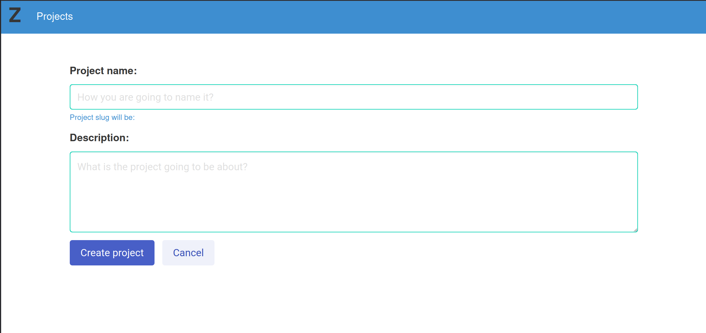
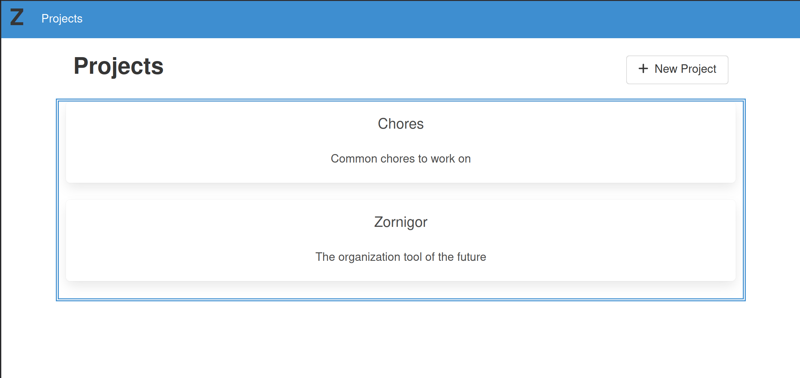
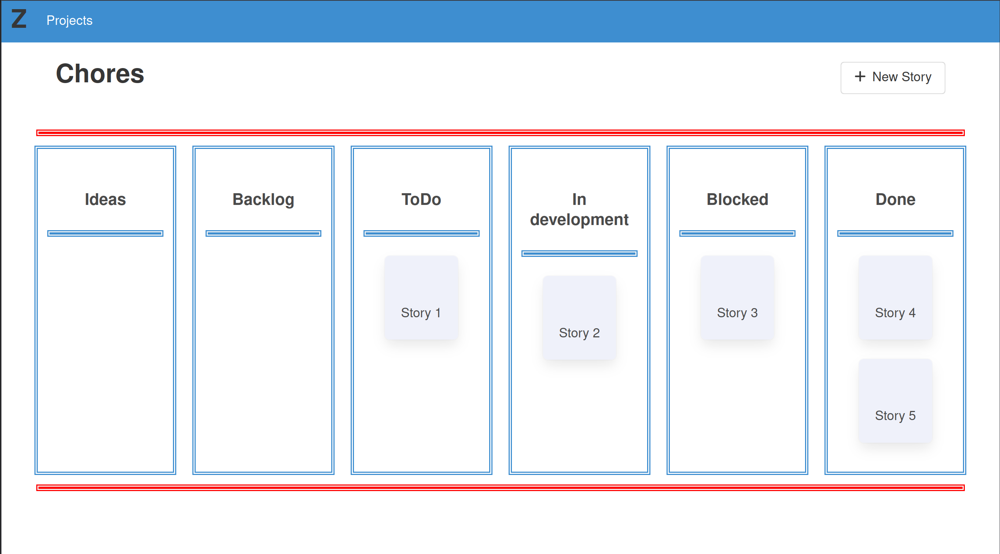
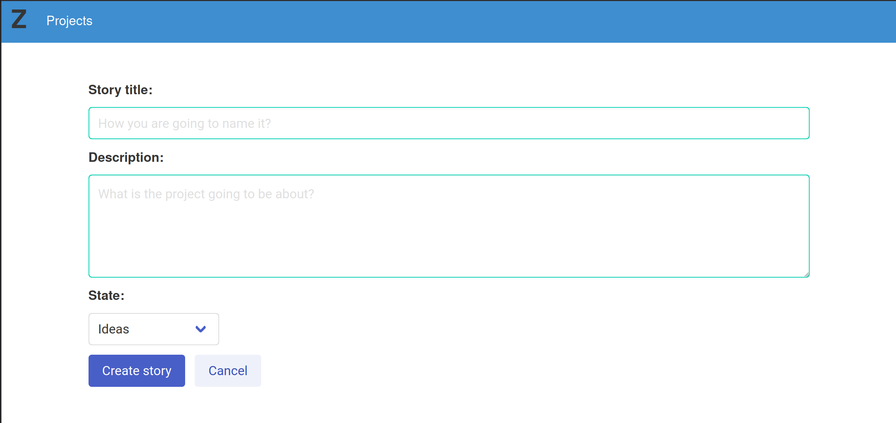
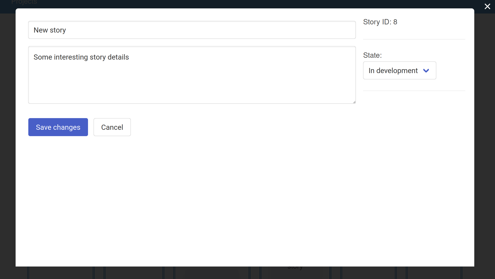

# Zornigor

Story-based multiplaform organization tool to manage your time and daily tasks
in an efficient manner

## API

Zornigor API is built in Python using `FastAPI`.

## Web frontend

A web frontend is built on top of `Vue3`.

Create new projects:

List existing projects:

Project stories dashboard:

Create new stories:

View and edit stories:

